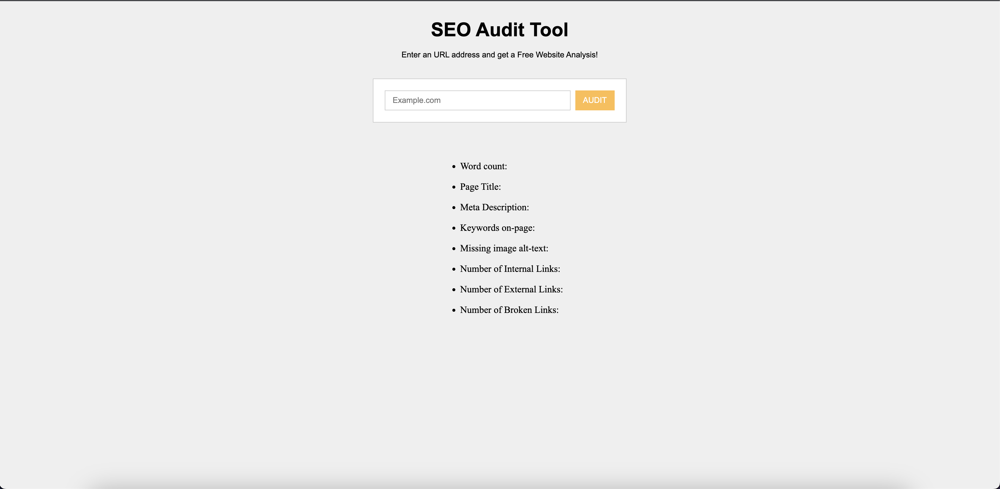
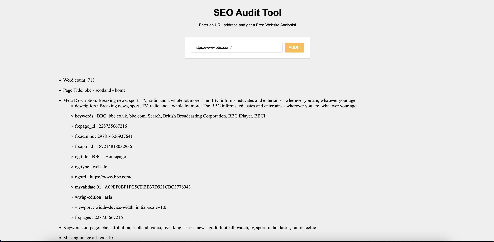

# SEO Analyzer Tool and news Scrapping

## Features

### 1. SEO Analyzer Tool
This is more like a data extraction from the website; scrape the source of the URL’s and extract the following information. 
- Word count
- Page Title
- Meta Description
- Keywords on-page
- Missing image alt-text
- Number of Internal Links
- Number of External Links
- Number of Broken Links

### 2. News Scrapper
A Python web scraper to extract the latest news articles from a news website and store the data in a database. The news websites currently supported: 
- CNN
- BBC
- The New York Times


## Installation

```bash
pip install -r requirements.txt
python manage.py migrate
python manage.py runserver
```

## How to use

### 1. SEO Analyzer

open http://localhost:8000, put link and hit 'Audit'

### 2. Scrapping

```bash
python manage.py scrape_news --site https://www.nytimes.com/ https://edition.cnn.com/
```

## Screenshots






## TODO

- [x] update readme seo-analyzer and scrapper
- [ ] using MySQL database optional
- [ ] add more news site (The Guardian, etc)