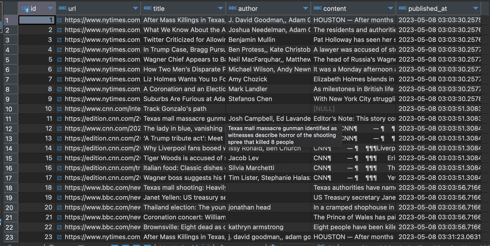

# Installation

```bash
pip install -r requirements.txt
python manage.py migrate
python manage.py runserver
```

# How to use

## SEO Analyzer
open http://localhost:8000

## Scrapping
```bash
python manage.py scrape_news --site https://www.nytimes.com/ https://edition.cnn.com/
```

# Screenshots



# TODO
- update readme seo-analyzer and scrapper
- using MySQL database optional
- add more news site (The Guardian, etc)